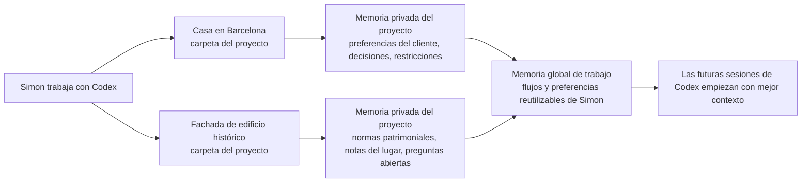

# Simon Work Memory Kit para Codex

[Read in English](README.md)

Haz que Codex recuerde contexto útil de tu trabajo sin tener que gestionar una
base de datos, una plataforma de conocimiento o una configuración complicada de
IA.

Esto es para personas que trabajan en varios proyectos reales y se cansan de
explicar el mismo contexto una y otra vez. El kit le da a Codex una libreta
privada y sencilla: una parte para cada proyecto, y otra parte para lo que sirve
en todo tu trabajo.

Ejemplo: Simon tiene un proyecto para una casa en Barcelona y otro proyecto para
la fachada de un edificio histórico en Valencia. Cada proyecto tiene sus propios
detalles, restricciones, personas, fechas y decisiones. Algunas notas pertenecen
solo a un proyecto. Otras notas, como la forma en la que Simon prefiere revisar
planos, son útiles en todas partes. Este kit ayuda a Codex a mantener separados
esos dos tipos de memoria.



## Para Qué Sirve

Usa esto cuando quieres que Codex recuerde cosas como:

- de qué trata un proyecto
- decisiones que ya se tomaron
- acrónimos, personas, lugares y abreviaturas recurrentes
- cómo te gusta preparar documentos, revisiones o planes
- qué contexto es privado y no debe acabar en archivos públicos

No es una app alojada en la nube. No envía tus notas a un servicio separado. Usa
archivos de texto locales que tú y Codex podéis revisar.

## Cómo Funciona

El kit crea dos capas de memoria:

1. **Memoria del proyecto** dentro de cada carpeta de trabajo importante, en un
   directorio privado llamado `memory/`. Esto es para el contexto que pertenece
   solo a ese proyecto.
2. **Memoria global de trabajo** en `~/Work-Memory`. Esto es para notas
   reutilizables que ayudan en varios proyectos.

Codex también recibe pequeñas instrucciones en archivos `AGENTS.md`, para saber
cuándo leer o actualizar esas memorias. Las instrucciones públicas se quedan en
archivos públicos. Los detalles privados se quedan en archivos locales privados.

## La Forma Fácil De Pedirle A Codex Que Lo Instale

Si alguien te envió este repositorio, abre Codex y pega esto:

```text
Instala Simon Work Memory Kit de forma global en mi configuración de Codex desde:
https://github.com/ezemriv/simon-codex-work-memory-kit.git

Usa el README del repositorio como fuente de verdad. Registra el marketplace del
plugin, instala el plugin y después ejecuta el skill de configuración global.
Pregúntame antes de guardar cualquier detalle personal sensible, y explícame qué
cambiaste cuando termines.
```

Codex probablemente tendrá que ejecutar comandos de terminal. Si te pide permiso,
aprueba solo si los comandos coinciden con los comandos de instalación de abajo.

## Instrucciones De Instalación Para Codex

Estas instrucciones son para Codex o para una persona técnica que esté ayudando a
otra.

Registra este repositorio como un marketplace de plugins de Codex:

```bash
codex plugin marketplace add https://github.com/ezemriv/simon-codex-work-memory-kit.git --ref main
```

Instala el plugin desde ese marketplace:

```bash
codex plugin add simon-codex-work-memory-kit@simon-work-memory
```

Abre una nueva conversación de Codex y ejecuta la configuración global:

```text
Use $work-memory-setup to initialize Simon Work Memory Kit.
```

Después, en cada carpeta de proyecto importante, pídele a Codex:

```text
Use $work-memory-project-start for this folder.
```

A partir de ahí, Codex puede usar el kit mientras trabaja:

- `$work-memory-project-update` actualiza la memoria privada del proyecto después
  de trabajo relevante.
- `$work-memory-consolidate` mueve aprendizajes reutilizables a `~/Work-Memory`
  cuando corresponde.
- `$work-memory-review` ayuda a revisar, limpiar o eliminar notas guardadas.

## Un Flujo Típico

1. Simon abre la carpeta de la casa en Barcelona y le pide a Codex ayuda para
   preparar una actualización para el cliente.
2. Codex lee las notas privadas de `memory/` de esa carpeta antes de redactar.
3. Durante el trabajo, Simon explica que el cliente prefiere opciones visuales
   concisas en vez de alternativas largas por escrito.
4. Codex guarda eso como memoria del proyecto de la casa en Barcelona.
5. Más adelante, Simon decide que esa es una preferencia general para varios
   proyectos.
6. Codex registra la preferencia generalizada en `~/Work-Memory`.
7. La semana siguiente, Simon abre la carpeta de la fachada histórica en
   Valencia. Codex recuerda la preferencia general de comunicación, pero mantiene
   los detalles específicos del cliente de Barcelona fuera del proyecto de
   Valencia.

## Reglas De Privacidad

El kit usa cinco clases de privacidad:

- `public-repo-safe`: seguro para documentación pública, plantillas, ejemplos y
  archivos README.
- `workspace-private`: útil solo dentro de una carpeta de proyecto.
- `global-private`: útil en varios proyectos, guardado en `~/Work-Memory`.
- `sensitive-review`: quizás útil, pero una persona debería aprobar la nota
  exacta antes.
- `do-not-store`: úsalo solo para la tarea actual y no lo guardes.

La idea por defecto es simple: recordar más en privado, publicar menos.

## Promesa Sin Infraestructura

No hay servidor que desplegar, base de datos que migrar, cuenta que crear ni
capa oculta de sincronización. El sistema de memoria son solo archivos de texto
organizados para que Codex y las personas puedan usarlos.

## v1 Solo Para Codex

La versión 1 es para Codex. El repositorio puede documentar ideas que más
adelante se traduzcan a otros agentes, pero la primera forma pública se centra en
el comportamiento de Codex, la documentación del plugin para Codex y la memoria
local en texto plano.

## Validar El Plugin

Después de cambiar metadatos del plugin o skills, valida con el validador del
skill local `plugin-creator`:

```bash
python3 ~/.codex/skills/.system/plugin-creator/scripts/validate_plugin.py plugins/simon-codex-work-memory-kit
```

Si tu entorno de Python no tiene PyYAML instalado, ejecuta el mismo comando desde
un entorno que sí lo tenga. La instalación del plugin en Codex es la prueba
práctica:

```bash
codex plugin marketplace add .
codex plugin add simon-codex-work-memory-kit@simon-work-memory
```

## Licencia

MIT. Ver `LICENSE`.
