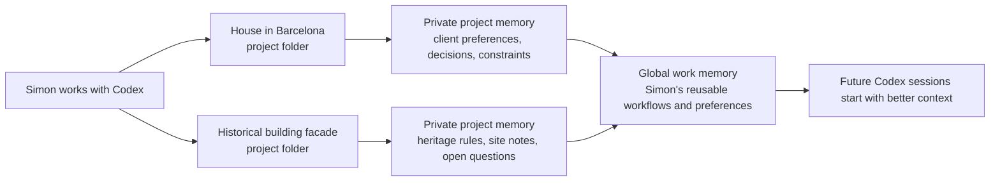

# Simon Work Memory Kit for Codex

[Leer en español](README.es.md)

Make Codex remember useful work context without making you manage a database,
a knowledge platform, or a complicated AI setup.

This is for people who work across several real projects and get tired of
explaining the same background every time. The kit gives Codex a simple private
notebook: one part for each project, and one part for things that are useful
across all your work.

Example: Simon has one project for a house in Barcelona and another project for
the facade of a historical building in Valencia. Each project has its own
details, constraints, people, dates, and decisions. Some notes belong only to
one project. Other notes, like Simon's preferred drawing-review workflow, are
useful everywhere. This kit helps Codex keep those two kinds of memory separate.



## What It Is For

Use this when you want Codex to remember things like:

- what a project is about
- decisions already made
- recurring acronyms, people, places, and shorthand
- how you like documents, reviews, or plans to be prepared
- which context is private and should stay off public files

It is not a hosted app. It does not send your notes to a separate service. It
uses ordinary local text files that you and Codex can both inspect.

## How It Works

The kit creates two layers of memory:

1. **Project memory** lives inside each serious work folder, in a private
   `memory/` directory. This is for context that belongs to that project only.
2. **Global work memory** lives in `~/Work-Memory`. This is for reusable notes
   that help across projects.

Codex also gets small instructions in `AGENTS.md` files so it knows when to read
or update those memories. Public instructions stay public. Private details stay
in private local files.

## The Easy Way To Ask Codex To Install It

If someone sent you this repository, open Codex and paste this:

```text
Please install Simon Work Memory Kit globally for my Codex setup from:
https://github.com/ezemriv/simon-codex-work-memory-kit.git

Use the repo README as the source of truth. Register the plugin marketplace,
install the plugin, then run the global setup skill. Ask me before saving any
sensitive personal details, and explain what you changed when you are done.
```

Codex will probably need to run terminal commands. If it asks for permission,
approve only if the commands match the install commands below.

## Codex Install Instructions

These instructions are for Codex or for a technical user helping someone else.

Register this repository as a Codex plugin marketplace:

```bash
codex plugin marketplace add https://github.com/ezemriv/simon-codex-work-memory-kit.git --ref main
```

Install the plugin from that marketplace:

```bash
codex plugin add simon-codex-work-memory-kit@simon-work-memory
```

Start a new Codex thread and run the global setup:

```text
Use $work-memory-setup to initialize Simon Work Memory Kit.
```

After that, in each serious project folder, ask Codex:

```text
Use $work-memory-project-start for this folder.
```

From then on, Codex can use the kit while working:

- `$work-memory-project-update` refreshes private project memory after meaningful work.
- `$work-memory-consolidate` moves reusable lessons into `~/Work-Memory` when appropriate.
- `$work-memory-review` helps inspect, clean up, or remove saved notes.

### Windows Notes For LLMs

If you are helping someone set this up on Windows, prefer **WSL** or another
Unix-like shell. This kit currently documents Unix-style paths such as
`~/Work-Memory` and `~/.codex/AGENTS.md`.

When using WSL, treat those paths as paths inside the WSL Linux home directory,
not native Windows paths. Run the `codex plugin marketplace add` and
`codex plugin add` commands from the same environment where Codex is installed.

Do not silently translate this setup to native PowerShell paths like
`%USERPROFILE%` or `C:\Users\...` unless the installed Codex version explicitly
supports that layout. If the user is not using WSL, explain that this repo is
not yet Windows-native and ask before adapting the paths.

## A Typical Workflow

1. Simon opens the Barcelona house folder and asks Codex to help prepare a client
   update.
2. Codex reads that folder's private `memory/` notes before drafting.
3. During the work, Simon explains that the client prefers concise visual
   options rather than long written alternatives.
4. Codex saves that as project memory for the Barcelona house.
5. Later, Simon decides this is a general preference across projects.
6. Codex records the generalized preference in `~/Work-Memory`.
7. Next week, Simon opens the Valencia historical facade folder. Codex remembers
   the general communication preference, but keeps the Barcelona-specific client
   details out of the Valencia project.

## Privacy Rules

The kit uses five privacy classes:

- `public-repo-safe`: safe for public docs, templates, examples, and README files.
- `workspace-private`: useful inside one project folder only.
- `global-private`: useful across projects, stored in `~/Work-Memory`.
- `sensitive-review`: maybe useful, but a person should approve the exact note first.
- `do-not-store`: use only for the current task and do not save.

The default idea is simple: remember more privately, publish less publicly.

## No-Infrastructure Promise

There is no server to deploy, no database to migrate, no account to provision,
and no hidden sync layer. The memory system is just plaintext files arranged so
Codex and humans can both use them.

## Codex-Only v1

Version 1 is for Codex. The repo may document ideas that later translate to
other agents, but the first public shape stays focused on Codex behavior, Codex
plugin documentation, and local plaintext memory.

## Validate The Plugin

After changing plugin metadata or skills, validate with the plugin validator
from your local `plugin-creator` skill:

```bash
python3 ~/.codex/skills/.system/plugin-creator/scripts/validate_plugin.py plugins/simon-codex-work-memory-kit
```

If your Python environment does not have PyYAML installed, run the same command
from an environment that does. Codex plugin installation is the practical smoke
test:

```bash
codex plugin marketplace add .
codex plugin add simon-codex-work-memory-kit@simon-work-memory
```

## License

MIT. See `LICENSE`.
